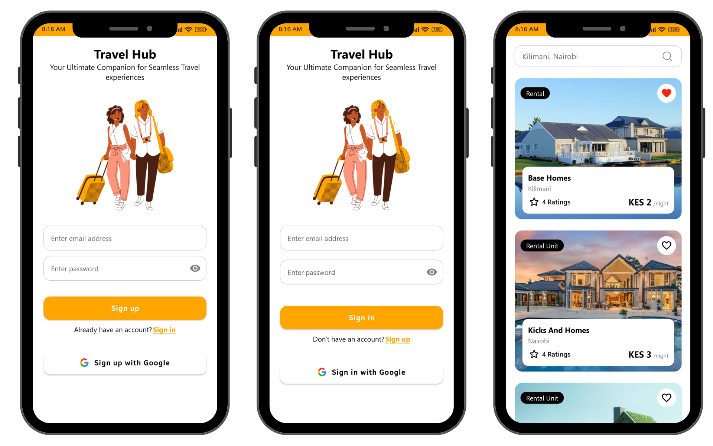
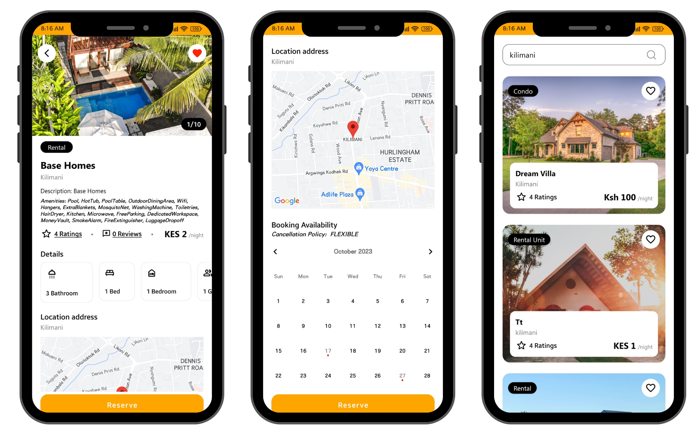

# Travel Hub - Explore Your Next Adventure 🌍✈️
Travel Hub is an Android application that allows users to discover and preview potential host places while traveling. It offers a seamless experience for exploring accommodation options, restaurants, and attractions. Users can also save their favorite places and view them on a map. 


## Features 🚀

- **User Authentication:** Securely authenticate users using Firebase email/password authentication and Google Sign-In.

- **Explore Listings:** Browse through a diverse range of listings to find the perfect place for your next adventure.

- **Listing Details:** Get detailed information about each listing, including descriptions, amenities, reviews, and more.

- **Interactive Maps:** View the location of each listing on an interactive map with a marker to guide your way.

- **Booking Availability:** Use the built-in calendar component to visualize booked dates for each listing.


## Screenshots 📷

A few screenshots of the app in action. 




## Usage 📝

**Step 1:** Sign in or create an account to start exploring. <br>
**Step 2:** Browse through the listings and select one to view more details. <br>
**Step 3:** View the listing on a map and check the availability calendar. <br>
**Step 4:** Favouite the listing if you like it.

## Technologies Used 🛠️

- **Android Studio:** The official integrated development environment (IDE) for Android app development.

- **Firebase:** A comprehensive mobile and web application development platform provided by Google, used for user authentication and more.

- **Google Maps API:** Integrating Google Maps for location visualization.

- **Dagger Hilt:** A dependency injection library for Android that reduces boilerplate code.

- **EventBus:** A publish/subscribe event bus for Android and Java.

- **Picasso:** A powerful image downloading and caching library for Android.


## Getting Started

### Prerequisites

- Android Studio
- Android SDK
- Firebase Project
- Google Maps API Key

### Installation

1. Clone the repo
   ```bash
   git clone https://github.com/your-username/travel-hub.git
    ```
2. Open the project in Android Studio
3. Build and run the project

## Contributing
Contributions are welcome! Feel free to submit a pull request or open an issue if you have any questions.

## License
Licensed under the MIT License. See `LICENSE` for more information.

Made by Lynne🌸